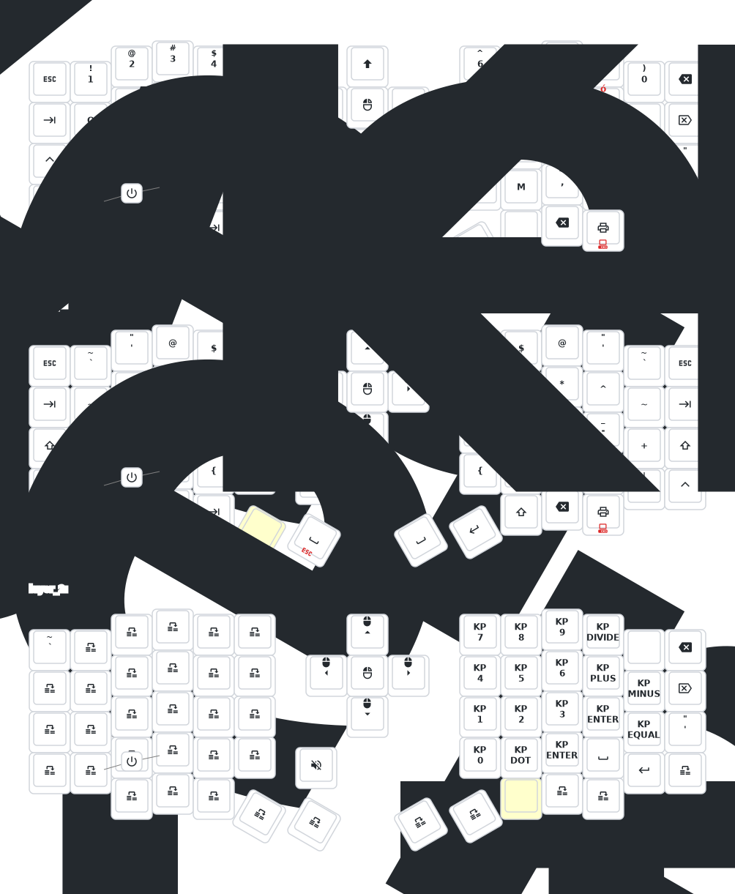

# Sofle

- [Chinese](README.md)
- [English](README_EN.md)

## Prerequisites

Before building the firmware, ensure you have the following installed:

- **Python 3.8+**
- **Git**
- **West** (Zephyr's meta-tool)
- **CMake** (3.20.0 or later)
- **Ninja**
- **DTL (Device Tree Compiler)**

### Installing Dependencies

#### Windows (using Chocolatey)
```bash
choco install python git cmake ninja dtc
pip install west
```

#### Linux/Ubuntu
```bash
sudo apt update
sudo apt install python3 python3-pip git cmake ninja-build device-tree-compiler
pip3 install west
```

#### macOS
```bash
brew install python git cmake ninja dtc
pip3 install west
```

## Setup Instructions

1. **Clone the repository:**
   ```bash
   git clone https://github.com/finnicius/zmk-sofle-keybindings
   cd zmk-sofle-keybindings
   ```

2. **Initialize West workspace:**
   ```bash
   west init -l config
   west update
   ```

3. **Install Zephyr dependencies:**
   ```bash
   pip install -r zephyr/scripts/requirements.txt
   ```

## Keymap Configuration

The keyboard layout is defined in `config/eyelash_sofle.keymap`. Here are the available layers:

### Layer 0 (Default)
- Standard QWERTY layout with some customizations
- Media controls on bottom row
- RGB controls and mouse controls on Layer 1

### Layer 1 (Navigation/Media)
- F1-F12 keys
- Arrow keys
- Mouse controls (left click, right click, scroll)
- RGB controls

### Layer 2 (Settings/Bootloader)
- Bluetooth device selection
- System reset and bootloader access
- Soft off function

### Layer 3 (Empty - Available for customization)

### Customizing Keymap

1. **Edit the keymap file:**
   - Open `config/eyelash_sofle.keymap`
   - Each layer is defined as a `bindings` array
   - Keys are mapped in a specific order (left to right, top to bottom)

2. **Understanding ZMK Key Codes:**
   - **Standard keys:** Use `&kp KEY_NAME` (e.g., `&kp A`, `&kp ENTER`)
   - **Modifiers:** `&kp LCTRL`, `&kp LALT`, `&kp LSHFT`, `&kp LGUI`
   - **Layer switching:** `&mo LAYER_NUMBER` (momentary), `&to LAYER_NUMBER` (toggle)
   - **Special functions:** `&bt BT_SEL 0` (Bluetooth device), `&sys_reset` (reset)
   - **Mouse:** `&mkp LCLK` (left click), `&mmv MOVE_UP` (mouse movement)

3. **ZMK Documentation Resources:**
   - [ZMK Keymap Documentation](https://zmk.dev/docs/keymaps)
   - [ZMK Key Codes Reference](https://zmk.dev/docs/keymaps/keycodes)
   - [ZMK Behaviors](https://zmk.dev/docs/behaviors)
   - [Complete Key Code List](https://zmk.dev/docs/keymaps/list-of-keycodes)

4. **Keymap Structure:**
   - **Layer 0:** Main typing layer (QWERTY)
   - **Layer 1:** Navigation/Media layer (F1-F12, arrows, mouse)
   - **Layer 2:** Settings/Bootloader layer (Bluetooth, reset)
   - **Layer 3:** Empty layer for custom functions

5. **Save and test:**
   - Save the file
   - Commit and push to trigger GitHub Actions
   - Download the generated firmware files

### Keymap Visualization

To generate a visual representation of your keymap:

1. Push your changes to GitHub
2. The GitHub Action will automatically generate an SVG in `keymap-drawer/eyelash_sofle.svg`

## Building the Firmware

### Option 1: Using GitHub Actions (Recommended)

1. **Commit and push your changes:**
   ```bash
   git add config/eyelash_sofle.keymap
   git commit -m "feat: update keymap configuration"
   git push origin main
   ```

2. **Monitor the build process:**
   - Go to the **Actions** tab in your GitHub repository
   - Click on the latest "Build ZMK firmware" workflow run
   - Wait for all jobs to complete (usually 5-15 minutes)

3. **Download the firmware:**
   - In the workflow run page, scroll down to "Artifacts"
   - Download the firmware files (`.uf2` files for both left and right sides)
   - The artifacts will be named according to your `build.yaml` configuration

### Option 2: Local Build

1. **Set up Zephyr environment:**
   ```bash
   # On Windows
   west zephyr-export

   # On Linux/macOS
   source zephyr/zephyr-env.sh
   ```

2. **Build the firmware:**
   ```bash
   # Build right side
   west build -b eyelash_sofle_right -- -DSHIELD=nice_view

   # Build left side with ZMK Studio support
   west build -b eyelash_sofle_left -- -DSHIELD=nice_view -DCONFIG_ZMK_STUDIO=y

   # Build left side for settings reset
   west build -b eyelash_sofle_left -- -DSHIELD=settings_reset
   ```

3. **Find the firmware files:**
   - Firmware files will be in `build/zephyr/zmk.uf2`

## Flashing the Firmware

### Using UF2 Bootloader

1. **Enter bootloader mode:**
   - Press the reset button twice quickly, or
   - Use the bootloader key combination (Layer 2 + BT key)

2. **Flash the firmware:**
   - Copy the `.uf2` file to the USB drive that appears
   - The keyboard will automatically restart with new firmware

### Using ZMK Studio (for left side only)

1. **Install ZMK Studio:**
   - Download from https://zmk.studio
   - Connect your keyboard

2. **Update firmware:**
   - Select your device in ZMK Studio
   - Upload the firmware file

## Troubleshooting

### Common Issues

**West update fails:**
```bash
# Clear west cache and retry
west update --narrow
```

**Build fails with missing dependencies:**
```bash
# Reinstall requirements
pip install -r zephyr/scripts/requirements.txt
```

**Keyboard not recognized:**
- Try a different USB cable
- Try a different USB port
- Check if the keyboard is in bootloader mode

**ZMK Studio connection issues:**
- Ensure you're using the left side firmware with Studio support
- Check USB connection
- Try refreshing the Studio interface

### Keymap Editing Troubleshooting

**Common Keymap Issues:**
- **Build fails with syntax error:** Check for missing semicolons or incorrect key code format
- **Key not working:** Verify the key code exists in ZMK documentation
- **Layer not switching:** Ensure layer numbers match (0, 1, 2, 3) and use correct behavior (`&mo` vs `&to`)
- **Mouse not working:** Check that mouse behaviors are properly configured in the keymap

**Testing Your Changes:**
- Always test keymap changes on one side first before flashing both
- Use the left side with ZMK Studio support for easier testing
- Keep backups of working keymap configurations

### Getting Help

- **ZMK Documentation:** [zmk.dev/docs](https://zmk.dev/docs)
- **ZMK Discord Community:** [discord.zmk.dev](https://zmk.dev/community/discord)
- **Keymap Examples:** [zmk.dev/docs/keymaps/examples](https://zmk.dev/docs/keymaps/examples)
- **Contact:** [380465425@qq.com](mailto:380465425@qq.com)

## Update List

- 2024/12/21
  1. Added support for zmk-studio (just refresh the left hand to use).
- 2024/10/24
  1. Modified power supply mode to reduce power consumption.
  2. Fixed the automatic shut-off feature for RGB power supply.
- 2025/8/22
  1. update the soft off.When you press the keys Q, S and Z simultaneously and hold them for 2 seconds, the keyboard will enter a deep sleep state and cannot be awakened by pressing the keys. This function can be used when carrying it outside. The activation method is to press the reset switch once.
  2. This month, I also updated the ultra-thin versions of the corne and sofle cases. The frame and base plate have been thickened, and the opening of the reset switch has been adjusted, so that the reset switch can be easily pressed. At present, we are still conceptualizing how to design the shell with an inclined bracket.If you have carefully examined a PCB, you will notice that there are reserved interfaces for expansion IO. I wonder if anyone has been able to utilize them,I will try it！
  3. The GIF animations on the right-hand keyboard screen have been removed, which will significantly reduce the power consumption of the right-hand keyboard.

> If your  sofle was updated before 2025/8/22, please update to the latest firmware.
>

## Contact Me

For 3D printed model files or any issues and malfunctions with the keyboard, please contact [380465425@qq.com](mailto:380465425@qq.com)

## Sofle Keymap


